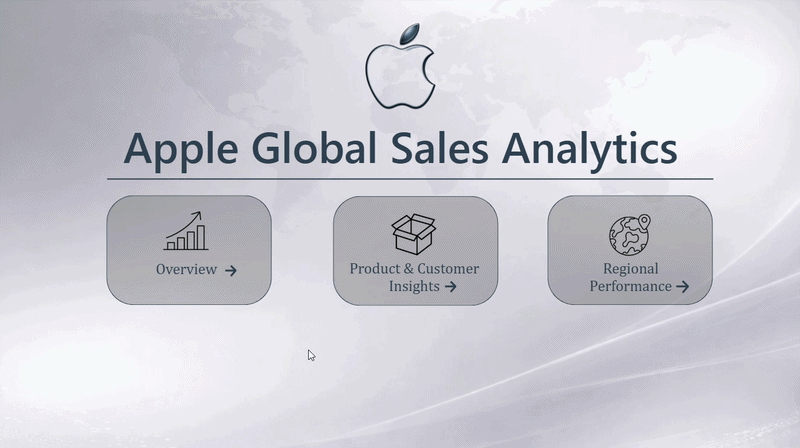
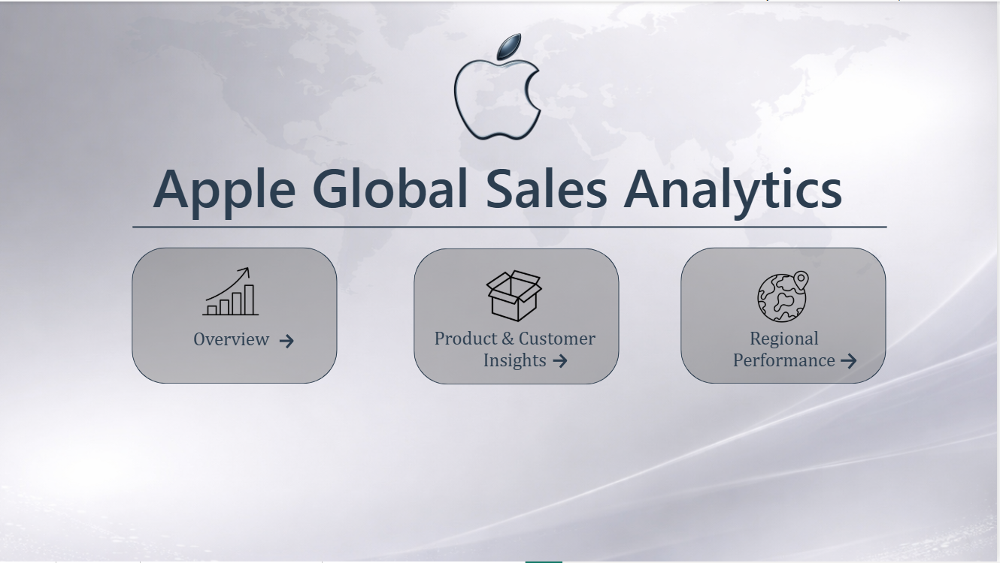
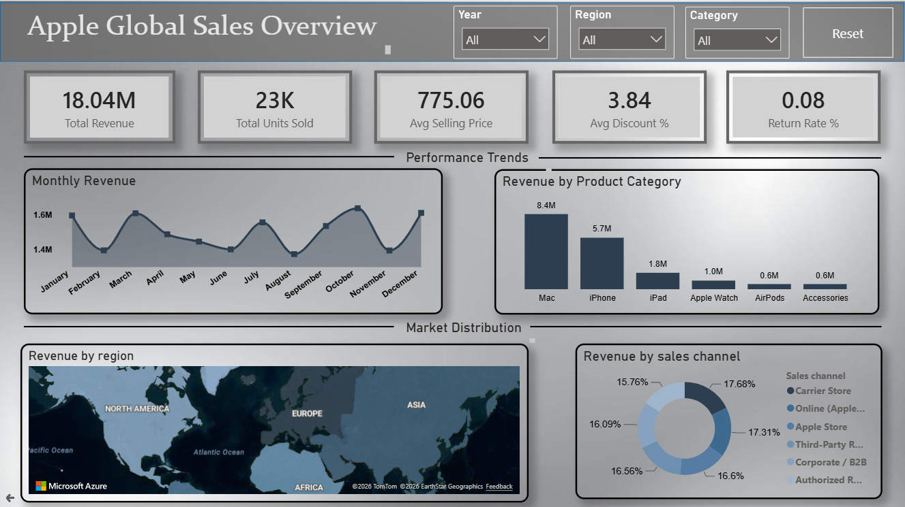
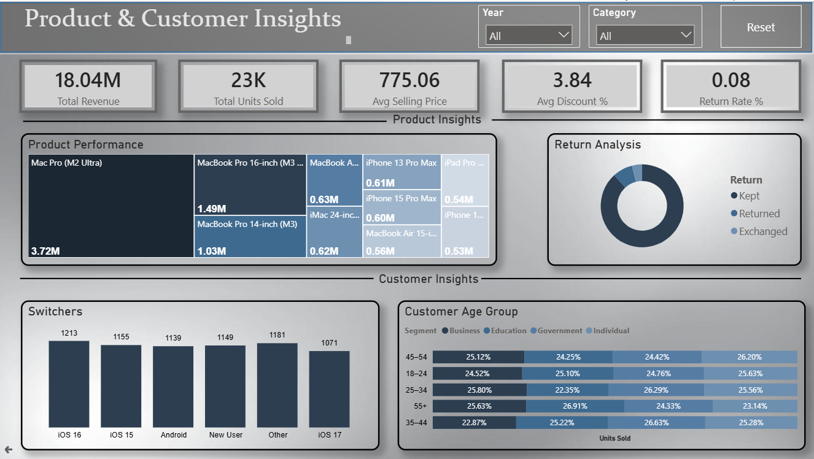
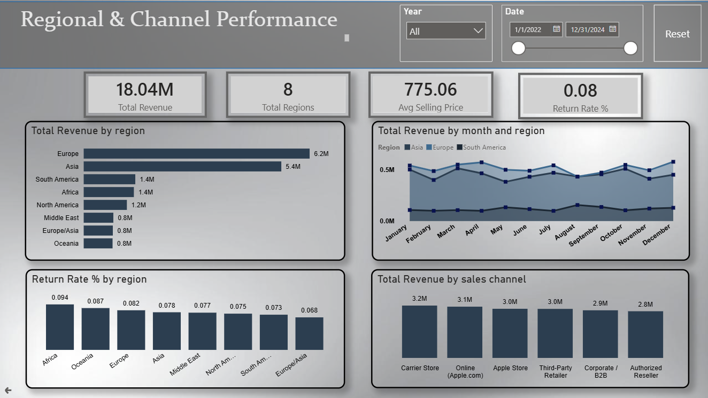

# 🍎 Apple Global Sales Analytics Dashboard

A comprehensive **Power BI dashboard** developed to analyze Apple product sales across multiple regions, product categories, customer segments, and sales channels. This dashboard transforms raw sales data into interactive visualizations that help uncover business insights and support data-driven decision-making.

---

# 📊 Dashboard Preview

  

---

# 📈 Dashboard Overview

This interactive dashboard provides a complete overview of Apple's global sales performance through four dedicated report pages. It enables users to explore revenue trends, product performance, customer behavior, and regional sales using dynamic filters and interactive visualizations.

---

# 📊 Key Metrics Summary

| Metric | Value |
|---------|-------|
| 💰 Total Revenue | **$18.04M** |
| 📦 Units Sold | **23,270** |
| 💵 Average Selling Price | **$777.37** |
| 🎁 Average Discount | **3.84%** |
| 🔄 Return Rate | **11.8%** |

---

# ❓ Power BI Questions Solved

## 📈 Sales Overview

This dashboard answers questions such as:

- What is the total revenue generated?
- How many products were sold?
- What is the average selling price?
- What is the average discount offered?
- Which months generated the highest revenue?
- Which product categories contribute the most revenue?
- Which regions generate the highest sales?
- Which sales channels perform the best?

---

## 📦 Product & Customer Insights

This dashboard helps analyze customer and product performance by answering:

- Which products generate the highest revenue?
- Which customer age groups purchase the most products?
- How are customers segmented?
- Which products experience higher return rates?
- How do customers switch between Apple products?

---

## 🌍 Regional Performance

This dashboard provides answers to questions including:

- Which regions generate the highest revenue?
- How does monthly revenue vary by region?
- Which sales channels perform best across regions?
- Which regions have higher product return rates?

---

# 📸 Dashboard Pages

## 🏠 Landing Page

Provides navigation to different dashboard sections.

  

---

## 📈 Sales Overview

  

### Dashboard Features

- Revenue KPI
- Units Sold KPI
- Average Selling Price
- Average Discount
- Return Rate
- Monthly Revenue Trend
- Revenue by Product Category
- Revenue by Region
- Revenue by Sales Channel

---

## 📦 Product & Customer Insights

  

### Dashboard Features

- Product Performance Analysis
- Customer Segmentation
- Customer Age Group Analysis
- Product Return Analysis
- Product Switching Analysis

---

## 🌍 Regional Performance

  

### Dashboard Features

- Revenue by Region
- Monthly Revenue Trend
- Revenue by Sales Channel
- Regional Return Rate Analysis

---

# 🎯 Business Insights

The dashboard reveals several important business insights:

- 💻 **Mac** products generated the highest revenue (**$8.37M**).
- 🌍 **Europe** was the highest-performing sales region (**$6.21M**).
- 🛒 **Carrier Stores** contributed the highest revenue among all sales channels.
- 📅 **October** and **December** recorded the strongest monthly sales performance.
- 🔄 The overall product return rate remained **11.8%**.

---

# 🔧 Dataset

The dashboard is built using transactional Apple sales data containing information such as:

- Order Date
- Product Name
- Product Category
- Region
- Country
- Sales Channel
- Units Sold
- Revenue
- Selling Price
- Discount
- Customer Segment
- Customer Age Group
- Payment Method
- Return Status

---

# 📊 Visualizations Used

- KPI Cards
- Line Charts
- Clustered Bar Charts
- Donut Charts
- Treemap
- Filled Maps
- Tables
- Interactive Slicers

---

# 🛠 Tech Stack

| Technology | Purpose |
|------------|---------|
| Microsoft Power BI | Dashboard Development |
| Power Query | Data Cleaning & Transformation |
| DAX | Measures & KPI Calculations |
| CSV | Dataset |

---

# 🚀 Viewing the Dashboard

To explore the dashboard:

1. Download or clone this repository.
2. Open the `.pbix` file using **Microsoft Power BI Desktop**.
3. Navigate through the report pages using the built-in navigation buttons.
4. Use the interactive slicers to filter and explore the data.

---

### Thank you for exploring this project! 🍎

---

## Author

**Stella Mary Biju**

- GitHub: https://github.com/stelabiju 
- LinkedIn: https://www.linkedin.com/in/stelabiju

---

## Copyright

© 2026 Stella Mary Biju. All rights reserved.

This project has been developed for portfolio and educational purposes. Please do not copy, reproduce, or submit this work as your own without appropriate permission or attribution.
